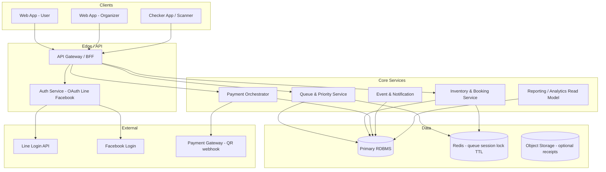
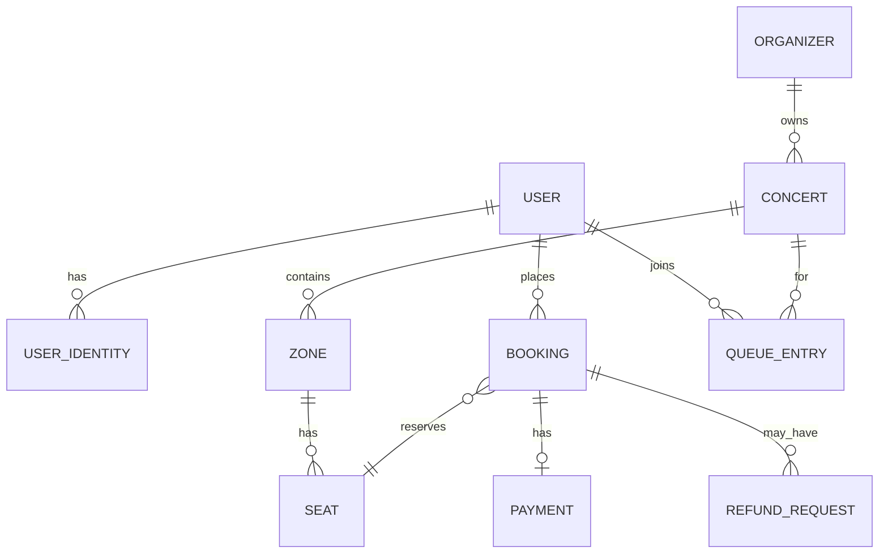

# Tooket-ther — แผนออกแบบสถาปัตยกรรม โฟลว์ และฐานข้อมูล

เอกสารนี้สรุปจากรายงาน CN230 (วพ.230) เพื่อใช้เป็นแนวทาง implement ระบบจองบัตรคอนเสิร์ตแบบ end-to-end

---

## 1. บริบทและบทบาทหลัก

| บทบาท | หน้าที่สำคัญ |
|--------|----------------|
| **User (ลูกค้า)** | ลงทะเบียน (OAuth), เข้าคิวตาม priority ภูมิลำเนา, เลือกโซน/ที่นั่ง, ชำระ QR, เลือกรับบัตร (ไปรษณีย์/หน้างาน), ดูประวัติ, คืนบัตร (ภายใน 7 วันก่อนคอนเสิร์ต) |
| **Organizer (ผู้จัด)** | ดูรายรับ-รายจ่าย, จัดการคิวชำระเงิน, ปิดโซนที่ขายไม่ถึงเกณฑ์, ย้ายโซนหรือคืนเงินเมื่อปิดโซน |
| **Ticket checker** | สแกน QR ตรวจความถูกต้องกับฐานข้อมูลกลาง |

**เป้าหมายทางเทคนิค:** priority queue ตามที่อยู่, ACID / concurrency control (soft lock), lifecycle บัตร (refund, ย้ายโซน), single source of truth สำหรับสถานะที่นั่ง

---

## 2. สถาปัตยกรรมระบบ (Logical Architecture)

**หลักการแบ่งชั้น**

- **BFF/API Layer:** รวม endpoint ตาม client, rate limit, validation
- **Auth:** รับ token จาก Line/Facebook → ออก session/JWT ภายใน → ผูก `user_id` หนึ่งบัญชี social ต่อประเภท (ตาม assumption ในรายงาน)
- **Queue & Priority:** คำนวณ `priority_score` จากข้อมูลผู้ใช้ + กฎ sales window; เก็บลำดับคิวใน Redis และ/หรือ DB
- **Inventory:** ที่นั่ง, soft lock, หมดเวลาจอง → คืนสถานะ; transaction ห่อการขาย/ย้ายโซน
- **Payment:** สร้าง QR, รับ webhook, อัปเดต `payment` + `booking` + `seat` แบบ atomic
- **Reporting:** อ่านแยก (read replica หรือ materialized view) เพื่อไม่แย่ง write path ตอนเปิดขาย

---

## 3. โฟลว์หลัก (Process Flows)

### 3.1 เข้าสู่ระบบ (OAuth)

1. Client เริ่ม OAuth กับ Line หรือ Facebook  
2. Auth service แลก code → profile → `upsert user` + `user_identity (provider, subject)`  
3. ออก JWT/session; บันทึก `last_login`, ไม่ให้ผูก provider ซ้ำกับ user อื่น  

### 3.2 เข้าคิวก่อนเลือกที่นั่ง (Sales window + priority)

1. User เลือกคอนเสิร์ต/รอบที่เปิดขาย  
2. ระบบตรวจว่าอยู่ในช่วงเวลาที่อนุญาตตาม **priority tier** (เช่น local ก่อน)  
3. สร้าง `queue_entry`: `enqueue_at`, `priority_score`, `status` (waiting / admitted / expired)  
4. เมื่อถึงคิว: ออก **admission token** (สั้น ๆ TTL) ให้เข้าหน้าเลือกที่นั่ง  
5. ถ้า timeout ไม่กดต่อ → ปลดคิว / เรียกคนถัดไป (ต้องกำหนดนโยบายชัดใน policy)

### 3.3 จองที่นั่ง + Soft lock

1. Client ส่ง `seat_ids` ที่ต้องการ (ภายใต้ admission token)  
2. **DB transaction:**  
   - `SELECT ... FOR UPDATE` บนแถว `seat` ที่เกี่ยวข้อง *หรือ* optimistic lock ด้วย `version`  
   - ตรวจ `status = available`  
   - ตั้ง `locked_until`, `status = locked`, สร้าง `booking` สถานะ `pending_payment`  
3. ตอบกลับเวลาหมดอายุการ lock (เช่น 10–15 นาที) — สอดคล้อง requirement “ไม่ชำระภายในเวลาที่กำหนด → ยกเลิกอัตโนมัติ”  
4. Worker/cron: คืน `seat` เป็น `available` เมื่อ `locked_until < now()` และยังไม่ชำระ  

### 3.4 ชำระเงิน QR

1. Payment service สร้างรายการชำระกับ gateway → ได้ QR / reference  
2. User สแกนจ่าย → gateway ส่ง webhook  
3. **Idempotent webhook handler:** อัปเดต `payment.status = succeeded`, `booking.status = paid`, `seat.status = sold`, บันทึก `holder_name` ตามที่กำหนด  
4. ส่งอีเมล/แจ้งเตือน (ถ้ามี) + อัปเดต “ตั๋วของฉัน”  

### 3.5 เลือกวิธีรับบัตร

- เก็บใน `booking` หรือ `fulfillment`: `delivery_method` ∈ { `postal`, `pickup_at_venue` }  
- ถ้าไปรษณีย์: ที่อยู่จัดส่ง (อาจตาราง `shipping_address` แยก)

### 3.6 คืนบัตร (ภายใน 7 วันก่อนคอนเสิร์ต — ตามรายงาน)

1. ตรวจ `concert.starts_at - now() >= 7 days` และสถานะบัตร `paid` ยังไม่ใช้งาน  
2. User กรอกข้อมูลบัญชีธนาคาร (โอนคืนเท่านั้น) → เก็บแบบเข้ารหัส / tokenize  
3. สร้าง `refund_request` → admin อนุมัติ (หรือ auto ตาม policy)  
4. Transaction: `booking` → `refunded`, `seat` → `available` (หรือ `released`), `payment` เชื่อม refund record  
5. Admin “ลบ/คืน”ที่นั่งใน DB ให้คนอื่นจอง — สถานะ seat ต้องสะท้อนจริง  

### 3.7 ปิดโซน (Organizer) + ย้ายหรือคืนเงิน

1. Organizer ดูสถิติจองต่อโซน; ถ้าต่ำกว่า threshold → สั่ง `zone_closure`  
2. ล็อกบัตรที่ขายแล้วในโซนนั้น  
3. แจ้ง user: เลือก **upgrade ที่นั่งฟรีในโซนใหม่** หรือ **คืนเงิน**  
4. ถ้าย้าย: สร้าง flow จองใหม่ (ยกเว้นค่าบัตร) + อัปเดต `seat`/`booking`  
5. โซนเดิม: `zone.status = closed` — **ไม่ลบแถว seat ทิ้ง** แนะนำเป็น soft-deactivate เพื่อ audit; ถ้ารายงานระบุ “ลบข้อมูลโซน” ให้ทำแบบ archive ก่อนลบจริง  

### 3.8 ตรวจบัตร (Checker)

1. QR มี `ticket_token` หรือ signed payload (ลายเซ็น HMAC/JWT สั้น ๆ)  
2. Lookup: `booking` + `seat` + `concert` + `user`  
3. ตรวจ: ชำระแล้ว, ไม่ refund, ไม่ถูกใช้แล้ว → อัปเดต `check_in_at` (one-time use)  

---

## 4. โมเดลข้อมูล (Database Design)

ใช้ **RDBMS** (PostgreSQL แนะนำ) เพื่อ transaction, constraint, และ row-level lock

### 4.1 ER แบบย่อ (ความสัมพันธ์)

### 4.2 ตารางหลัก (ร่าง schema)

**users**

| Column | Type | Notes |
|--------|------|--------|
| id | UUID PK | |
| display_name | text | |
| email | text nullable | |
| address_line, subdistrict, district, province, postal_code | text | ใช้คำนวณ priority / local tier |
| priority_tier | smallint | cache จากกฎ + ที่อยู่ |
| created_at | timestamptz | |

**user_identities** (หนึ่ง provider ต่อ user ตาม assumption)

| Column | Type | Notes |
|--------|------|--------|
| id | UUID PK | |
| user_id | UUID FK users | |
| provider | text | `line` / `facebook` |
| provider_subject | text UNIQUE per provider | |
| created_at | timestamptz | |

**organizers**

| id, name, ... | |

**concerts**

| id, organizer_id FK, title, venue, starts_at, ends_at, sales_starts_at, status | |

**zones**

| id, concert_id FK, name, price, total_seats, status (`open`/`closed`), min_sales_threshold nullable | |

**seats**

| id, zone_id FK, row_label, seat_no, status (`available`/`locked`/`sold`), locked_until nullable, version int (optimistic) | |

**bookings**

| id, user_id, concert_id, seat_id UNIQUE(active), status (`pending_payment`/`paid`/`cancelled`/`refunded`/`moved`), holder_name, delivery_method, locked_until, check_in_at nullable, created_at | |

- Constraint: ที่นั่งหนึ่งตัวต่อบัตรที่ active — ใช้ partial unique index เช่น `UNIQUE(seat_id) WHERE status IN ('pending_payment','paid')`

**payments**

| id, booking_id FK, amount, method (`qr`), external_ref, status, raw_webhook jsonb nullable, created_at | |

**refund_requests**

| id, booking_id, bank_account_encrypted or token, status, processed_at | |

**queue_entries** (ถ้าต้องการ persist คิว)

| id, concert_id, user_id, priority_score, entered_at, status, admitted_at nullable, session_id | |

**organizer_ledger / expenses** (สำหรับรายรับ-รายจ่าย)

| id, concert_id, type (`revenue`/`expense`), amount, description, occurred_at | |

**zone_closure_events** (audit)

| id, zone_id, reason, closed_at, moved_booking_count | |

### 4.3 Indexes ที่สำคัญ

- `seats(zone_id, status)` — แสดงที่ว่างเร็ว  
- `bookings(user_id, created_at DESC)` — ประวัติ  
- `queue_entries(concert_id, status, priority_score DESC, entered_at)` — dequeue  
- `payments(external_ref)` UNIQUE — idempotency webhook  
- `user_identities(provider, provider_subject)` UNIQUE  

### 4.4 Concurrency & ACID

- การจอง: **หนึ่ง transaction** ล็อกที่นั่ง + สร้าง booking  
- **SELECT FOR UPDATE** บน `seats` ที่เลือก หรือ optimistic `UPDATE seats SET ... WHERE id=? AND version=? AND status='available'`  
- Payment success: transaction เดียวกับอัปเดต seat + booking  
- เกณฑ์ “ไม่ double booking”: enforced ที่ DB (unique + status) ไม่ใช่แค่ที่แอป  

### 4.5 Cache / Redis (ถ้าใช้)

- คิว real-time: sorted set `queue:{concert_id}` score = f(priority, time)  
- Rate limit ต่อ user/IP  
- ล็อกสั้น ๆ ระหว่าง retry (optional) — ระวังซ้ำกับ DB lock  

---

## 5. Integration & Security

| พื้นที่ | แนวทาง |
|---------|--------|
| Line / Facebook | OAuth2; เก็บเฉพาะ subject + token refresh ตาม best practice |
| Payment QR | Webhook ลง signature verify; idempotency key; timeout ชำระ sync กับ `locked_until` |
| PII / บัญชีธนาคาร | เข้ารหัส at rest, จำกัดสิทธิ์ admin, audit log |
| QR บัตร | ลายเซ็นเวลาหมดอายุหรือ one-time token ที่ backend ออกใหม่เมื่อเปิดดูตั๋ว |

---

## 6. แผนพัฒนาตามรายงาน (อ้างอิง Future Work)

1. **Phase 1:** UI ลงทะเบียน + จอง; backend คิว + priority จากที่อยู่  
2. **Phase 2:** QR payment, timer คืนที่นั่ง, ปิดโซน + consolidation  
3. **Phase 3:** Dashboard รายรับ-รายจ่าย, checker QR  
4. **Phase 4:** ทดสอบ concurrency + ความถูกต้องประวัติ/คืนบัตร/ปิดโซน  

---

## 7. สรุปการตัดสินใจออกแบบ

- **ฐานข้อมูลกลาง** เป็นผู้ตัดสินสถานะที่นั่ง; Redis ช่วยคิวและ TTL ไม่แทนที่ความจริงของ seat  
- **Soft lock + timeout** ตอบโจทย์ race condition และ UX  
- **Priority** แยกเป็น tier + ช่วงเวลาขาย ลดความซับซ้อน query  
- **ปิดโซน** ควรมีตาราง audit และเลี่ยง hard delete ข้อมูล ticket/seat ที่อาจต้องพิสูจน์ย้อนหลัง  

เอกสารนี้ปรับขยายจาก entity เบื้องต้นในรายงาน (User, Concert/Zone, Seat, Booking/Transaction, Payment) ให้พร้อมสำหรับ implementation และทดสอบภาระสูงในวันเปิดขาย
