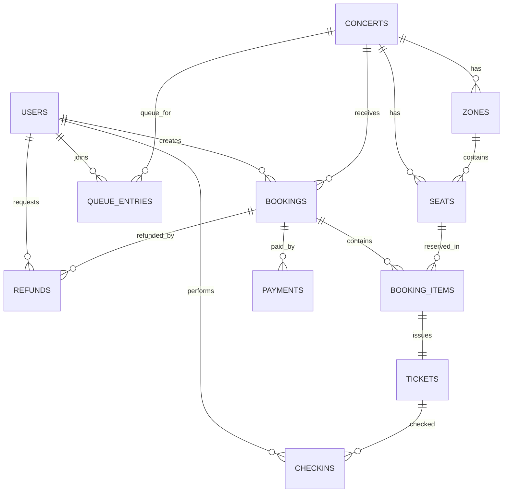

# CN230 Tooket-ther - Week 1 Analysis and Database Design

## 1) Requirements Collection

### 1.1 Problem Statement
ระบบต้องรองรับการจองบัตรคอนเสิร์ตแบบออนไลน์ครบวงจร ตั้งแต่การล็อกอิน, เข้าคิว, เลือกที่นั่ง, ชำระเงิน, ออกตั๋ว, เช็กอิน และคืนเงิน โดยคงความถูกต้องของข้อมูลเมื่อมีผู้ใช้จำนวนมากพร้อมกัน

### 1.2 Stakeholders
- **Customer (ผู้ซื้อบัตร):** ต้องการซื้อบัตรได้รวดเร็ว เห็นสถานะจอง/ชำระเงินชัดเจน
- **Organizer (ผู้จัดงาน):** ต้องการจัดการคอนเสิร์ต โซนที่นั่ง ราคา และดูรายงานยอดขาย
- **Checker (เจ้าหน้าที่หน้างาน):** ต้องการสแกนตั๋วและเช็กอินได้เร็ว ป้องกันการใช้ตั๋วซ้า
- **Admin/System Operator:** ดูแลระบบ ค่า config และความเสถียรของบริการ
- **Payment Gateway (External):** ส่งผลการชำระเงินกลับเข้าระบบอย่างถูกต้องและ idempotent

### 1.3 Use Cases (High Level)
1. ผู้ใช้สมัคร/ล็อกอินด้วย OAuth
2. ผู้ใช้ค้นหาและดูรายละเอียดคอนเสิร์ต
3. ผู้ใช้เข้าคิวเพื่อรอสิทธิ์จอง
4. ผู้ใช้เลือกที่นั่งและสร้าง booking
5. ผู้ใช้ชำระเงินและรับผลชำระเงิน
6. ระบบออกตั๋ว (ticket) หลังชำระสาเร็จ
7. เจ้าหน้าที่เช็กอินด้วย ticket code
8. ผู้ใช้ยื่นคืนเงิน และผู้จัดอนุมัติ/ปฏิเสธ
9. ผู้จัดดูรายงานการขายและ occupancy

### 1.4 Functional Requirements (>=5)
- **FR-01 Authentication:** ระบบต้องรองรับ OAuth login และออก access token ให้ผู้ใช้
- **FR-02 Concert Catalog:** ระบบต้องแสดงรายการคอนเสิร์ต พร้อมวันเวลา สถานที่ และสถานะขาย
- **FR-03 Queue Control:** ระบบต้องให้ผู้ใช้เข้าคิวและตรวจสถานะคิวได้
- **FR-04 Seat Booking:** ระบบต้องป้องกันการจองที่นั่งซ้าด้วย transaction + unique constraint
- **FR-05 Payment Handling:** ระบบต้องบันทึกผลชำระเงินและอัปเดต booking status ตามผลลัพธ์
- **FR-06 Ticketing:** ระบบต้องสร้าง ticket code ต่อที่นั่งที่ชำระเงินแล้ว
- **FR-07 Check-in:** ระบบต้องเปลี่ยนสถานะตั๋วเป็น used เมื่อเช็กอินสาเร็จ และไม่ให้ใช้ซ้า
- **FR-08 Refund Policy:** ระบบต้องตรวจเงื่อนไขการคืนเงินก่อนสร้างรายการ refund
- **FR-09 Reporting:** ระบบต้องสร้างรายงานยอดขาย การใช้งานที่นั่ง และสถิติการเช็กอิน

## 2) ERD (Textual)

## 3) Relational Schema

### users
- `id` UUID PK
- `email` VARCHAR(255) UNIQUE NOT NULL
- `display_name` VARCHAR(120) NOT NULL
- `role` VARCHAR(20) NOT NULL CHECK role in (`customer`,`organizer`,`checker`,`admin`)
- `oauth_provider` VARCHAR(30) NULL
- `oauth_subject` VARCHAR(255) NULL
- `created_at` TIMESTAMP NOT NULL
- `updated_at` TIMESTAMP NOT NULL

### concerts
- `id` UUID PK
- `organizer_id` UUID FK -> users(id)
- `title` VARCHAR(200) NOT NULL
- `venue_name` VARCHAR(200) NOT NULL
- `starts_at` TIMESTAMP NOT NULL
- `sales_start_at` TIMESTAMP NOT NULL
- `sales_end_at` TIMESTAMP NOT NULL
- `status` VARCHAR(20) NOT NULL CHECK status in (`draft`,`on_sale`,`sold_out`,`closed`)
- `host_country_code` CHAR(2) NOT NULL
- `created_at` TIMESTAMP NOT NULL
- `updated_at` TIMESTAMP NOT NULL

### zones
- `id` UUID PK
- `concert_id` UUID FK -> concerts(id)
- `name` VARCHAR(80) NOT NULL
- `price_cents` INTEGER NOT NULL CHECK > 0
- `capacity` INTEGER NOT NULL CHECK >= 0
- `is_open` BOOLEAN NOT NULL DEFAULT true
- UNIQUE (`concert_id`, `name`)

### seats
- `id` UUID PK
- `concert_id` UUID FK -> concerts(id)
- `zone_id` UUID FK -> zones(id)
- `seat_label` VARCHAR(40) NOT NULL
- `is_accessible` BOOLEAN NOT NULL DEFAULT false
- UNIQUE (`concert_id`, `seat_label`)

### queue_entries
- `id` UUID PK
- `concert_id` UUID FK -> concerts(id)
- `user_id` UUID FK -> users(id)
- `queue_no` INTEGER NOT NULL
- `status` VARCHAR(20) NOT NULL CHECK status in (`waiting`,`admitted`,`expired`,`cancelled`)
- `joined_at` TIMESTAMP NOT NULL
- `admitted_at` TIMESTAMP NULL
- UNIQUE (`concert_id`, `user_id`)
- UNIQUE (`concert_id`, `queue_no`)

### bookings
- `id` UUID PK
- `concert_id` UUID FK -> concerts(id)
- `user_id` UUID FK -> users(id)
- `status` VARCHAR(20) NOT NULL CHECK status in (`pending_payment`,`paid`,`cancelled`,`expired`,`refunded`)
- `total_amount_cents` INTEGER NOT NULL CHECK >= 0
- `hold_expires_at` TIMESTAMP NULL
- `created_at` TIMESTAMP NOT NULL
- `updated_at` TIMESTAMP NOT NULL

### booking_items
- `id` UUID PK
- `booking_id` UUID FK -> bookings(id)
- `seat_id` UUID FK -> seats(id)
- `price_cents` INTEGER NOT NULL CHECK > 0
- `status` VARCHAR(20) NOT NULL CHECK status in (`held`,`confirmed`,`released`,`refunded`)
- UNIQUE (`seat_id`)  # one active ownership at a time in MVP

### payments
- `id` UUID PK
- `booking_id` UUID FK -> bookings(id)
- `provider` VARCHAR(40) NOT NULL
- `provider_txn_id` VARCHAR(120) UNIQUE NOT NULL
- `amount_cents` INTEGER NOT NULL CHECK > 0
- `status` VARCHAR(20) NOT NULL CHECK status in (`pending`,`success`,`failed`,`cancelled`)
- `paid_at` TIMESTAMP NULL
- `created_at` TIMESTAMP NOT NULL

### tickets
- `id` UUID PK
- `booking_item_id` UUID FK -> booking_items(id) UNIQUE
- `ticket_code` VARCHAR(64) UNIQUE NOT NULL
- `status` VARCHAR(20) NOT NULL CHECK status in (`valid`,`used`,`void`,`refunded`)
- `issued_at` TIMESTAMP NOT NULL

### checkins
- `id` UUID PK
- `ticket_id` UUID FK -> tickets(id)
- `checker_user_id` UUID FK -> users(id)
- `checked_in_at` TIMESTAMP NOT NULL

### refunds
- `id` UUID PK
- `booking_id` UUID FK -> bookings(id)
- `requested_by` UUID FK -> users(id)
- `approved_by` UUID FK -> users(id) NULL
- `amount_cents` INTEGER NOT NULL CHECK > 0
- `reason` TEXT NULL
- `status` VARCHAR(20) NOT NULL CHECK status in (`requested`,`approved`,`rejected`,`completed`)
- `requested_at` TIMESTAMP NOT NULL
- `approved_at` TIMESTAMP NULL

## 4) Normalization Summary

- **1NF:** ทุกตารางใช้ค่าที่เป็น atomic value ไม่มี repeating groups
- **2NF:** ตารางที่มีคีย์เดี่ยว (UUID) ไม่มี partial dependency
- **3NF:** แยกข้อมูลเชิงอ้างอิงออกตาม entity (เช่น users, concerts, zones, seats) เพื่อลด transitive dependency
- **BCNF (practical subset):** determinant หลักถูกกำหนดเป็น candidate key/unique constraints เช่น
  - `users.email`
  - `queue_entries (concert_id, queue_no)`
  - `seats (concert_id, seat_label)`
  - `payments.provider_txn_id`

## 5) Assumptions

- MVP นี้ออกแบบ `seats` เป็น per-concert seat inventory (ไม่ reuse ข้ามคอนเสิร์ต)
- การกันที่นั่งใช้ `booking_items` + booking status เพื่อป้องกันจองซ้า
- เงินใช้หน่วย `cents` เพื่อลดปัญหา floating point
- เวลาทั้งหมดเก็บเป็น UTC
