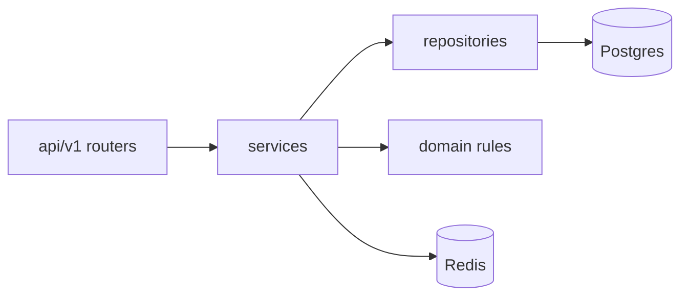

# Tooket-ther — แผน Implement (Python)

เอกสารนี้แตกจาก [design_plan.md](./design_plan.md) เป็นงานย่อย พร้อม tech stack, design pattern และหลักการเขียนโค้ดให้อ่านง่ายเป็นระบบ

---

## 1. Tech stack (Python)

| ชั้น | เลือกใช้ | เหตุผลสั้น ๆ |
|------|-----------|----------------|
| **Runtime** | Python 3.12+ | typing, performance, ecosystem |
| **API** | [FastAPI](https://fastapi.tiangolo.com/) | OpenAPI อัตโนมัติ, dependency injection ชัด, async |
| **Validation / DTO** | Pydantic v2 | request/response schema ชัดเจน แยกจาก ORM |
| **ORM / DB** | SQLAlchemy 2.0 + [Alembic](https://alembic.sqlalchemy.org/) | transaction, `FOR UPDATE`, migration เป็นมาตรฐาน |
| **DB** | PostgreSQL 16+ | ACID, partial unique index, row lock |
| **Cache / Queue ช่วย** | Redis 7+ | sorted set คิว, TTL admission token, rate limit |
| **Background jobs** | [ARQ](https://arq-docs.helpmanual.io/) หรือ Celery | ปลดล็อกที่นั่งหมดเวลา, ส่งอีเมล (ถ้ามี) — ARQ เบากว่า ถ้าต้องการง่ายเริ่มด้วย **APScheduler** ใน process เดียวก็ได้ (MVP) |
| **Auth** | OAuth2 client → JWT ภายใน (`python-jose` หรือ `PyJWT`) | แยก session ออกจาก Line/Facebook |
| **HTTP client** | httpx | เรียก OAuth / payment webhook verify |
| **Config** | pydantic-settings | `DATABASE_URL`, `REDIS_URL`, secrets |
| **Testing** | pytest, pytest-asyncio, httpx ASGITransport | API + integration กับ Testcontainers (Postgres/Redis) ถ้าต้องการ |
| **Lint / format** | ruff, (optional) mypy strict แบบค่อย ๆ เพิ่ม | โค้ดสม่ำเสมอ อ่านง่าย |

**Frontend (นอกขอบเขต backend แต่แนะนำให้สอดคล้อง):** React/Next.js หรือ HTMX + template — เชื่อมผ่าน OpenAPI client ที่ generate ได้

---

## 2. โครงสร้างโปรเจกต์ (อ่านง่าย แยกชั้นชัด)

แนว **Layered + module ตาม bounded context** (ไม่บังคับ DDD เต็มรูป แต่โฟลเดอร์สื่อความหมาย)

```text
tooket_ther/
  app/
    main.py                 # FastAPI app, router รวม
    config.py               # Settings
    api/
      deps.py               # get_db, get_current_user, get_redis
      v1/
        auth.py
        concerts.py
        queue.py
        bookings.py
        payments.py
        organizer.py
        checker.py
    domain/                 # กฎธุรกิจ pure (optional แต่แนะนำสำหรับ refund / priority)
      booking_rules.py
      refund_policy.py
      priority.py
    services/               # use case orchestration (บางทีเรียก application layer)
      auth_service.py
      queue_service.py
      booking_service.py
      payment_service.py
      organizer_service.py
      checkin_service.py
    repositories/           # DB access บาง entity
      user_repo.py
      seat_repo.py
      booking_repo.py
    integrations/           # adapter ภายนอก
      oauth/
        line_client.py
        facebook_client.py
      payment/
        gateway_stub.py     # MVP: mock QR + webhook
    models/                 # SQLAlchemy models
    schemas/                # Pydantic in/out
    workers/                # ARQ/Celery/scheduler tasks
  alembic/
  tests/
```

หลักการ: **Router บาง** → เรียก **Service** → **Repository** คุยกับ DB — ไม่ใส่ SQL ใน router

---

## 3. Design patterns ที่เลือกใช้ (และใช้เมื่อไหร่)

| Pattern | ใช้กับ | Logic / เหตุผล |
|---------|--------|----------------|
| **Repository** | `SeatRepository`, `BookingRepository` | รวม query + `lock_seats_for_update()` ไว้ที่เดียว อ่านง่าย ทดสอบแยก DB ได้ |
| **Unit of Work** | SQLAlchemy `session` เป็นขอบเขต transaction | `async with session.begin():` ครอบจองที่นั่ง + สร้าง booking ให้ atomic |
| **Service layer** | `BookingService`, `PaymentService` | หนึ่งเมธอด = หนึ่ง use case (`create_hold`, `confirm_payment`) ชื่อสื่อความหมาย |
| **Strategy** | `PriorityStrategy` (local vs general), `SalesWindowPolicy` | เปลี่ยนกฎ priority / เวลาขายโดยไม่แกะ if ยาวใน service |
| **Factory** | `OAuthProviderFactory.get("line" \| "facebook")` | สร้าง client ที่ถูกต้องจากพารามิเตอร์ route |
| **Template method** (เบา ๆ) | flow ชำระเงิน: สร้างรายการ → รอ webhook → finalize | subclass หรือ protocol สำหรับ gateway จริง vs stub |
| **Idempotent consumer** | webhook ชำระเงิน | `external_ref` UNIQUE + early return ถ้าประมวลผลแล้ว |
| **DTO / Anti-corruption** | Pydantic schema ไม่ leak ORM ออก API | ชัดเจน ว่า field ไหนส่งออกได้ |

**ไม่บังคับใน MVP:** Event sourcing, microservice แยก process — เริ่ม monolith ชัดชั้นพอ

---

## 4. หลักการ logic ให้อ่านเข้าใจง่าย

1. **ชื่อเมธอดเป็นประโยค:** `can_request_refund(booking, concert, now)` แทน `check_r1`  
2. **Guard clause ก่อน:** ตรวจสิทธิ์ / สถานะ / เวลา แล้ว `raise HTTPException` หรือ domain exception ชัด  
3. **Magic number รวมที่ config/constants:** `PAYMENT_HOLD_MINUTES`, `REFUND_DAYS_BEFORE_CONCERT = 7`  
4. **สถานะเป็น Enum** (Python `StrEnum`): `SeatStatus`, `BookingStatus` — ไม่ใช้ string กระจาย  
5. **ข้อผิดพลาดธุรกิจ** แยกจากข้อผิดพลาดระบบ: ใช้ exception class เล็ก ๆ หรือ `Result` pattern ถ้าทีมชอบ functional  
6. **Concurrency:** จองที่นั่งทำใน **transaction เดียว** + `SELECT FOR UPDATE` ตามลำดับ `seat_id` (สกัด deadlock)

---

## 5. Task list — Implement ตามลำดับ (ทำทีละกลุ่ม)

### Phase 0 — โครงร่างโปรเจกต์

- [#] **T0.1** สร้าง repo layout ตามโครงสร้างด้านบน + `pyproject.toml` (หรือ requirements) + `README` รัน local  
- [#] **T0.2** `Settings` จาก env + `.env.example`  
- [#] **T0.3** FastAPI `main` + health check + CORS (ตามที่ต้องใช้)  
- [#] **T0.4** Alembic init + migration แรก (ตารางหลักจาก design_plan: users, user_identities, organizers, concerts, zones, seats, bookings, payments, …)

### Phase 1 — Auth + ผู้ใช้ + คิว

- [x] **T1.1** Models + repositories: `User`, `UserIdentity`  
- [x] **T1.2** OAuth callback (Line/Facebook): แลก code → upsert user — ใช้ **Factory** เลือก provider  
- [x] **T1.3** ออก JWT + `deps.get_current_user`  
- [x] **T1.4** `PriorityStrategy`: คำนวณ `priority_tier` / score จากที่อยู่ (MVP: ฟิลด์ province ตรงกับประเทศจัดงาน = tier สูง)  
- [x] **T1.5** `QueueService`: enqueue / poll position / admit — Redis sorted set + บันทึก `queue_entries` (ถ้าต้องการ persist)  
- [x] **T1.6** API: `POST /concerts/{id}/queue/join`, `GET .../status`, `POST .../admit` (หรือ SSE/WebSocket ภายหลัง)  
- [x] **T1.7** **Admission token** (JWT สั้น TTL หรือ Redis key) ก่อนเข้าหน้าเลือกที่นั่ง

### Phase 2 — Inventory & จอง (หัวใจของระบบ)

- [x] **T2.1** `SeatRepository.list_available(zone_id)`, `lock_seats(seat_ids, user_id, until)` ด้วย transaction + `FOR UPDATE`  
- [x] **T2.2** `BookingService.create_hold`: สร้าง `booking pending_payment` + อัปเดต seat `locked`  
- [x] **T2.3** Constraint DB: partial unique บน `seat_id` กับสถานะ active (ตาม design_plan)  
- [x] **T2.4** API: เลือกที่นั่ง + สร้าง hold (ตรวจ admission token)  
- [x] **T2.5** Worker/scheduler: `release_expired_holds` — คืน `available` เมื่อหมดเวลาและยังไม่จ่าย  
- [x] **T2.6** API: ประวัติการซื้อของ user, อัปเดต `holder_name`, `delivery_method`

### Phase 3 — Payment (QR) + webhook

- [x] **T3.1** `PaymentGateway` interface + **stub** สร้าง QR ref + simulate success (สำหรับ dev)  
- [x] **T3.2** `PaymentService.create_payment_for_booking`  
- [x] **T3.3** Webhook endpoint: verify signature (ถ้ามี) + **idempotent** ด้วย `external_ref`  
- [x] **T3.3b** Transaction เดียว: `payment succeeded` → `booking paid` → `seat sold`  
- [x] **T3.4** (Optional) คิวชำระเงินตามลำดับ — ถ้า requirement บังคับ ให้เชื่อมกับ `QueueService` หรือล็อก “checkout slot”

### Phase 4 — Refund + ปิดโซน (Organizer)

- [x] **T4.1** `refund_policy` ใน `domain/`: ตรวจ 7 วันก่อนคอนเสิร์ต + สถานะบัตร  
- [x] **T4.2** API user: สร้าง `refund_request` + เก็บบัญชี (เข้ารหัส/placeholder ใน MVP)  
- [x] **T4.3** API organizer: อนุมัติ refund → transaction คืน seat + อัปเดต booking  
- [x] **T4.4** `OrganizerService.close_zone`: ตรวจ threshold → ปิด zone + สร้างงานย้าย/คืนเงิน + **zone_closure_events**  
- [x] **T4.5** Flow ย้ายที่นั่งฟรี: hold ใหม่ในโซนเป้าหมายโดยไม่คิดเงิน (state machine ชัด)

### Phase 5 — Checker + Reporting

- [x] **T5.1** สร้าง **signed ticket payload** (JWT/HMAC) สำหรับ QR  
- [x] **T5.2** `CheckinService.verify_and_checkin` — one-time `check_in_at`  
- [x] **T5.3** Organizer dashboard: aggregate รายรับ/รายจ่ายจาก `payments` + `organizer_ledger`  
- [x] **T5.4** รายงานจองต่อโซน (สำหรับตัดสินใจปิดโซน)

### Phase 6 — คุณภาพและความพร้อม production

- [x] **T6.1** pytest: unit สำหรับ `PriorityStrategy`, `refund_policy`  
- [x] **T6.2** integration: จองที่นั่งพร้อมกัน 2 client → assert ไม่ double book  
- [x] **T6.3** OpenAPI tag แยก role (user / organizer / checker) + security scheme  
- [x] **T6.4** เอกสารสั้น ๆ วิธีรัน docker-compose (Postgres + Redis)

---

## 6. Dependency flow (สรุปภาพรวม)



---

## 7. MVP ที่ตัดได้ถ้าเวลาน้อย

- เริ่ม **OAuth แค่หนึ่ง provider** (Line หรือ Facebook) แต่เก็บ **Factory** ไว้เสียบตัวที่สองทีหลัง  
- Payment ใช้ **stub + webhook จำลอง** ก่อน แล้วค่อยเสียบ gateway จริงผ่าน **Strategy/Template**  
- คิว: ใช้ **Redis only** ก่อน ค่อย sync `queue_entries` ลง Postgres เมื่อต้อง audit

---

## 8. Mapping กับ design_plan

| หัวข้อใน design_plan | Task หลัก |
|---------------------|-----------|
| OAuth, JWT | T1.2, T1.3 |
| Priority queue | T1.4, T1.5, T1.7 |
| Soft lock, expiry | T2.1–T2.5 |
| QR, idempotent webhook | T3.1–T3.3b |
| Refund 7 วัน | T4.1–T4.3 |
| ปิดโซน, ย้าย/คืน | T4.4, T4.5 |
| Checker QR | T5.1, T5.2 |
| Dashboard | T5.3, T5.4 |

---

แผนนี้ตั้งใจให้ทีม implement เป็นขั้น ๆ โดยโค้ดอ่านตามโฟลเดอร์รู้เรื่อง **API → Service → Repository → DB** และใช้ **pattern เฉพาะจุดที่ลดความซับซ้อน** ไม่ over-engineer สำหรับรายวิชา/โปรเจกต์ขนาดกลาง
